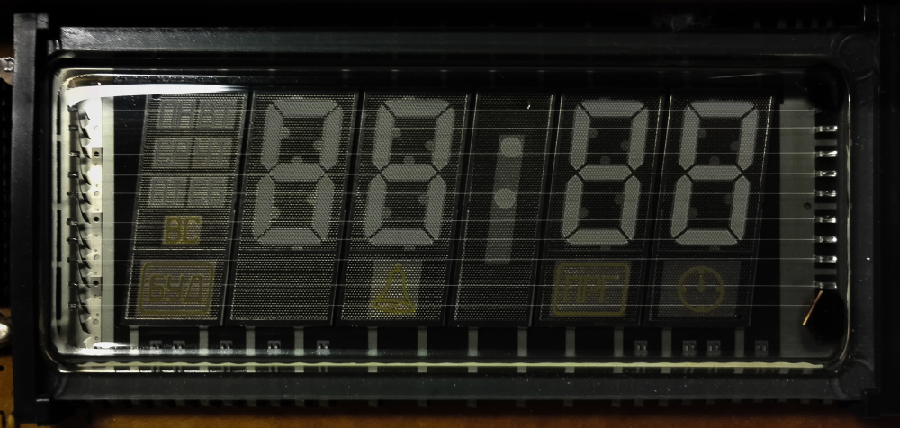
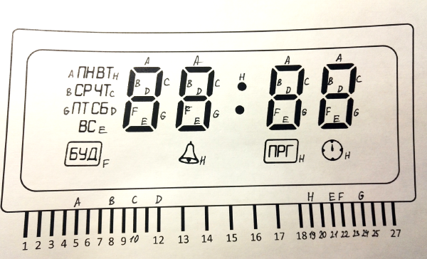

 

## Вакуумный люминесцентный индикатор П-543 

А точнее - его эмулятор. **[Видео](https://www.youtube.com/watch?v=4sCQg3f0Cz4)**

### Принцип работы 

Программа получает данные из COM порта, который нужно выбрать в меню **COM > Settings** 

На вход должна принимать такие данные: 

1. Байт маски для сегментов разряда 
2. Байт маски номера разряда 
3. Два байта новой строки (\n\r -- 13 10) как разделитель 

И того 4 байта. 

В настоящих аналоговых часах есть регистры, которые хранят в себе последний записанный байт. Что бы выводить данные на всех разрядах сразу, необходима **динамическая индикация**. Эмулятор же работает чуть по другому - он помнит данные для всех разрядов и стирает данные после их получения (то есть вам нужно непрерывно отправлять данные).

### Схема

Файл Resources/SdvugReg_7segment_02_lite.ino - предназначен для ардуино и STM32generic (файл проекта для ардуино IDE).

